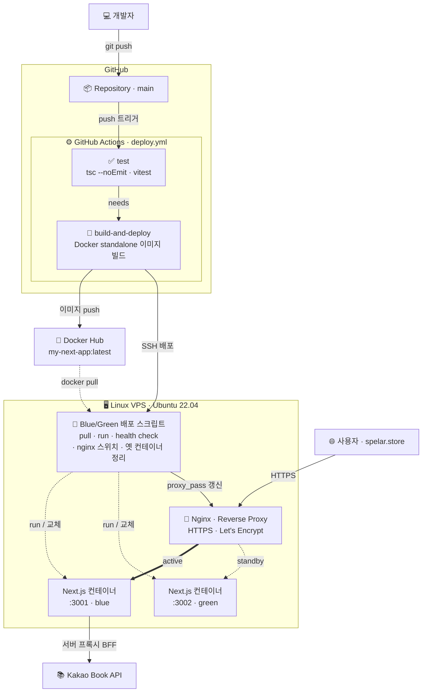

# My Next.js Blue/Green Deployment Project

## 소개

이 프로젝트는 KaKao Open API를 활용하여 책 검색 웹 애플리케이션을 구현한 예시입니다. 사용자가 입력한 검색어로 책 정보를 불러오고, 무한 스크롤 기능을 통해 결과를 편리하게 탐색할 수 있습니다.

## 개발 방식

이 프로젝트는 **AI 에이전트 기반 개발(Claude Code)** 로 구축되었습니다. 컨텍스트 문서화 · 테스트 동반 · CI 게이트를 원칙으로 삼았으며, 방법론과 실제 적용을 회고로 정리했습니다 →
**[AI 에이전트 기반 개발 도입기](docs/ai-driven-development.md)**

## 프로젝트 개요

이 프로젝트는 **Next.js** 기반의 웹 서비스를
- **Docker** 컨테이너로 빌드하고,
- **Nginx**로 Reverse Proxy를 구성하여,
- **Linux 서버**(예: Ubuntu)에
- **Blue/Green 무중단 배포** 방식으로 운영하도록 자동화된 인프라/배포 환경을 구축합니다.

CI/CD 자동화에는 **GitHub Actions**를 사용하며,
최종적으로 **DNS 설정 및 TLS(HTTPS) 인증서를 적용**합니다.

---

## 아키텍처 & 배포 흐름

`main` 브랜치에 push하면 GitHub Actions가 **테스트 게이트 → Docker 이미지 빌드 → Docker Hub push → SSH 무중단 배포**까지 자동으로 수행합니다.

- **테스트 게이트** — `test` 잡(타입체크 + Vitest)이 통과해야 `build-and-deploy`가 실행됩니다.
- **무중단 배포** — 새 컨테이너를 띄우고 health check가 통과하면 Nginx `proxy_pass`를 전환한 뒤 이전 컨테이너를 정리합니다. (health check 실패 시 전환하지 않고 롤백)
- **자동 복구** — 컨테이너에 `--restart unless-stopped` 정책을 적용해 재부팅·크래시 후에도 자동으로 기동됩니다.
- **HTTPS** — Let's Encrypt 인증서로 TLS를 적용하고 HTTP→HTTPS로 리다이렉트합니다.
- **API 키 보호** — Kakao REST 키는 서버 라우트(`/api/kakao-proxy`)에서만 사용해 클라이언트에 노출되지 않습니다.

---

## 기술 스택

- **프레임워크**: [Next.js](https://nextjs.org/)
- **웹 서버/Proxy**: [Nginx](https://nginx.org/)
- **OS**: Linux (예: Ubuntu 22.04)
- **컨테이너**: Docker
- **CI/CD**: GitHub Actions
- **배포 전략**: Blue/Green Deployment
- **도메인/DNS**:  
  - [https://spelar.store](https://spelar.store)
  - [https://www.spelar.store](https://www.spelar.store)
- **TLS 인증서**: Let's Encrypt (무료 SSL)

---